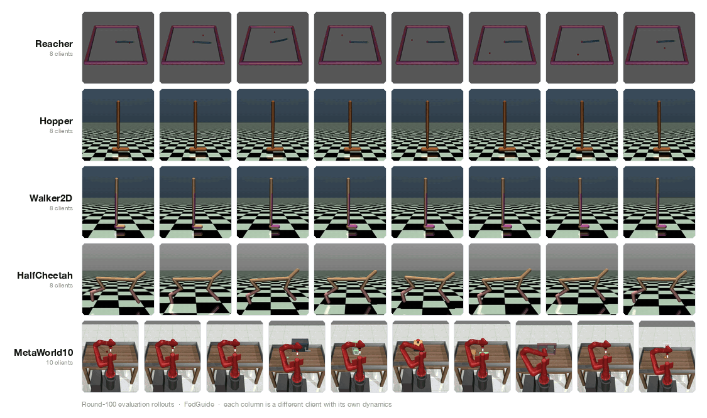

# [CoRL 2026] [FedGuide: Diffusion Prior Alignment and Value Baseline Guidance for Heterogeneous Federated Reinforcement Learning](https://github.com/hhhhzl/fedguide)

<table style="border: none;">
<tr>
<td style="vertical-align: middle; border: none;">
  
</td>
<td style="vertical-align: middle; border: none;">
  <i>Zhilin He, Gauri Joshi. <strong>FedGuide: Diffusion Prior Alignment and Value Baseline Guidance for Heterogeneous Federated Reinforcement Learning</strong>. Conference on Robot Learning 2026.</i>
</td>
</tr>
</table>

<p align="center">
  
</p>
<p align="center">
  <sub>
    Round-100 evaluation rollouts from the <b>same</b> FedGuide run. Rows are environments, columns are
    federated clients: <b>M = 8</b> for the locomotion suites, one per ML10 task for MetaWorld10. Locomotion
    clients differ in mass, damping, friction, actuation gain and reward preference; MetaWorld clients differ
    in the task itself. Each row is a single federation coping with heterogeneity — not a set of
    independently trained policies.
  </sub>
</p>

---

## Updates

- **[2026-09-04]** The work has been accepted to CoRL 2026 and open-sourced. 🎉🎉 We will public camera-ready version to shortly.

---

## Overview

Federated RL usually synchronizes **parameters** — policies or value networks are averaged, and the
averaging step silently assumes clients see the same distribution. Under heterogeneous dynamics that
assumption breaks: averaging collapses distinct behavior modes into a single compromise policy that is
optimal for no one.

FedGuide moves the synchronization from parameter space to **distribution space**:

1. **Diffusion priors as behavior models.** Each client pretrains a diffusion prior over its own
   data-supported action distribution, so a client is represented by *what it does*, not by its weights.
2. **OT-MoE aggregation.** The server never averages priors. It scores client priors against a bank of
   experts with a score-MSE cost, solves a Sinkhorn optimal-transport plan, refreshes the expert heads, and
   routes a *personalized* mixture back to each client — preserving heterogeneous modes instead of blurring them.
3. **DICE value baseline.** A distribution-correction-estimation critic supplies a low-variance,
   return-aware baseline that is blended into GAE, so prior guidance improves the policy rather than merely
   constraining it.

```
                     ┌───────────────────────────── Server ─────────────────────────────┐
                     │   score-MSE cost  ──▶  Sinkhorn OT plan  ──▶  expert head refresh │
                     │        C(i,m)                  Y*                    ψ⁽ᵐ⁾         │
                     └──────────▲──────────────────────────────────────────────┬─────────┘
                     client     │ ψᵢ                              personalized │ π̄_D,i
                     priors     │                                        prior ▼
                     ┌──────────┴──────────────────────────────────────────────────────┐
                     │  Client i:  rollout ──▶ DICE baseline V_φ ──▶ blended V ──▶ GAE  │
                     │                                                    ──▶ PPO step │
                     │  every client runs its own dynamics + reward preference         │
                     └─────────────────────────────────────────────────────────────────┘
```

Two ablations ship alongside the full method: **FedGuide-A** (aggregation only) and **FedGuide-P**
(personalized prior only).

---

## Installation

**Requirements**
- Python ≥ 3.10

**Tested configurations**
- Ubuntu 22.04
- CUDA 11.8.0 / 12.1.1
- PyTorch 2.1.0 / 2.2.0

**Install MuJoCo and mujoco-py** (Linux only):
```bash
./scripts/setup/install_mujoco_linux.sh
./scripts/setup/install_mujoco_py_linux.sh
```

> [!NOTE]
> Make sure `LD_LIBRARY_PATH` picks up the MuJoCo binaries before continuing:
> ```bash
> export LD_LIBRARY_PATH=$LD_LIBRARY_PATH:/root/.mujoco/mujoco210/bin
> source ~/.bashrc
> ```

**Setup**
```bash
./scripts/setup/setup.sh
```

The federation itself runs on [Flower](https://flower.ai/); optimal transport uses
[POT](https://pythonot.github.io/). See [`requirements.txt`](requirements.txt) for the pinned stack.

---

## Architecture Overview

FedGuide is organized so that each round flows top-down through four concerns: aggregation, routing, local
improvement, and the prior that ties them together.

| Concern | Module | Responsibility |
| :--- | :--- | :--- |
| Server strategy | [`fedguide/fed/fedguide/server.py`](fedguide/fed/fedguide/server.py) | Flower strategy driving each round: collect client priors, dispatch aggregation, broadcast personalized priors. |
| OT-MoE aggregation | [`fedguide/fed/fedguide/aggregator.py`](fedguide/fed/fedguide/aggregator.py) | Score-MSE cost matrix, Sinkhorn OT plan, expert-head refresh, personalized routing. |
| Client update | [`fedguide/fed/fedguide/client.py`](fedguide/fed/fedguide/client.py) | Per-client heterogeneous env construction, prior-guided PPO step, prior upload. |
| Diffusion prior | [`fedguide/guidance/diffusion_prior.py`](fedguide/guidance/diffusion_prior.py) | `DiffusionGuidance` score network used as the behavior model. |
| Prior pretraining | [`fedguide/guidance/pretrain.py`](fedguide/guidance/pretrain.py) | Per-client diffusion prior + SDICE critic warm start. |
| DICE value baseline | [`fedguide/agents/fedguide_agent.py`](fedguide/agents/fedguide_agent.py) | Distribution-correction baseline blended into GAE. |
| Heterogeneity split | [`fedguide/datasets/heterogeneity.py`](fedguide/datasets/heterogeneity.py) | Dirichlet trajectory partitioning across clients. |
| Env variants | [`fedguide/envs/mujoco_locomotion_hetero.py`](fedguide/envs/mujoco_locomotion_hetero.py) | Per-client mass / damping / friction / reward scaling. |

```
   server.py        ──▶      aggregator.py       ──▶      client.py      ──▶  fedguide_agent.py
(round orchestration)   (OT-MoE over priors)      (local rollout + PPO)     (DICE baseline)
```

Baselines live under [`fedguide/baselines/`](fedguide/baselines/) — `fedkl`, `fedrl`, `fedmomentum`
(FedSVRPG-M), `fedrep`, `fmarl`, `mfpo`, plus single-agent `ppo` / `sac` references.

---

## Pipeline

```
generate_all.sh  →  pretrain_bc.sh + pretrain_prior.sh  →  run_online_federated.sh  →  plot_posttrain.py
   (data)                    (warm start)                      (federated RL)            (figures)
```

### 1. Generate heterogeneous data

Per-env metadata, heterogeneous datasets, and env preview images (`assets/envs/`):

```bash
./scripts/generate_all.sh                  # everything (data + images)
./scripts/generate_all.sh --envs reacher   # one env
./scripts/generate_all.sh --skip-images    # data only
```

Each environment gets a `data/<env>/metadata.json` describing every client's world:

```json
{ "client_id": 0, "dynamics_preset": "nominal", "preference_preset": "speed",
  "mass_scale": 0.972, "damping_scale": 0.983, "ground_friction": 1.095,
  "action_gain": 0.918, "forward_reward_weight": 1.095, "ctrl_cost_weight": 0.0012 }
```

### 2. Pretrain the diffusion prior

BC warm-start policies and the `DiffusionGuidance` (UNet) prior + SDICE critic, one per client:

```bash
./scripts/pretrain_bc.sh        # → model/bc_policy/<Env>/client_<i>/
./scripts/pretrain_prior.sh     # → model/models_prior/<Env>/client_<i>/
```

Pass an env name to either script to run just one, e.g. `./scripts/pretrain_prior.sh halfcheetah`.

### 3. Federated training

Online federated training over the (env, algorithm, seed) grid. Algorithms: `fedavg`, `fedkl`, `fedrl`,
`fedmomentum`, `fedguide`, `fedguide_a`, `fedguide_p`.

```bash
./scripts/run_online_federated.sh                                        # full grid (5 envs × 7 algos × 3 seeds)
./scripts/run_online_federated.sh --envs halfcheetah --algos fedguide --seeds 0
./scripts/run_online_federated.sh --envs hopper --algos fedguide --rounds 50
```

> [!NOTE]
> The full grid is long-running. Start from a single `(env, algo, seed)` triple to validate your setup
> before launching the sweep.

Outputs:
- Metrics — `metrics/<env>_phase1/<algo>/seed_<s>/training_history.pkl`
- Rollout videos — `plots/<env>/<algo>/seed_<s>/client_<i>/round_<NNNN>.mp4`

### 4. Figures

```bash
python scripts/viz/plot_posttrain.py --main       # main-env training curves
python scripts/viz/compute_table_metrics.py       # the F / W results table
python scripts/viz/compute_fg_family_table.py     # the CV volatility table
```

Regenerate the README hero GIF from the rollout videos:

```bash
python scripts/make_combined_gif.py               # env × client grid (assets/gifs/all_envs.gif)
python scripts/make_combined_gif.py --preview     # single PNG, fast design check
python scripts/make_combined_gif.py --layout methods   # FedGuide / -A / -P comparison grid
```

---

## Run With Your Own Environment

Adding a heterogeneous environment takes four steps.

### 1. Define the per-client environment

Add a module under [`fedguide/envs/`](fedguide/envs/) exposing a
`make_<name>_env_if_applicable(metadata_path, client_id, seed, render_mode)` factory that returns a
configured env for one client, or `None` if the metadata is not for your environment. Use
[`mujoco_locomotion_hetero.py`](fedguide/envs/mujoco_locomotion_hetero.py) as a template — it shows how
`mass_scale`, `damping_scale` and `ground_friction` are applied to the `mj_model` per client.

### 2. Register the factory

Add your hook to `_make_env` in
[`fedguide/fed/fedguide/client.py`](fedguide/fed/fedguide/client.py); factories are tried in order and the
first non-`None` result wins.

### 3. Emit heterogeneity metadata

Add a generator under [`scripts/generate_data/`](scripts/generate_data/) that writes
`data/<env>/metadata.json` with one entry per client (schema as in step 1 of the pipeline), then wire it into
[`scripts/generate_all.sh`](scripts/generate_all.sh).

### 4. Add a config and launch

Copy [`configs/hopper/main/fedguide.yaml`](configs/hopper/main/fedguide.yaml) to
`configs/<env>/main/fedguide.yaml` and point it at your metadata:

```yaml
env_type: "d4rl"                 # selects the runner module
env_name: "MyEnv-v4"             # passed through to the per-client env factory
metadata_path: "data/myenv/metadata.json"
num_clients: 8
rounds: 100
```

```bash
python scripts/run_from_config.py configs/myenv/main/fedguide.yaml --algorithm fedguide --seeds 0
```

Any YAML key can be overridden from the command line without editing the config, which makes sweeps cheap:

```bash
python scripts/run_from_config.py configs/myenv/main/fedguide.yaml \
  --algorithm fedguide --seeds 0,1,2 --rounds 50 \
  --set ot_reg=0.1 --set lambda_guide=0.3
```

The knobs that matter most when tuning FedGuide on a new environment:

| Key | Meaning | Default |
| :--- | :--- | :--- |
| `lambda_guide` | Weight of prior guidance in the client objective | `0.5` |
| `lambda_guide_anneal` | Decay guidance as the policy improves | `true` |
| `num_experts_prior` | Size of the server-side expert bank | `8` |
| `ot_mode` / `ot_reg` | OT solver and Sinkhorn entropic regularization | `sinkhorn` / `0.05` |
| `personalized_routing` | Route a per-client mixture instead of one global prior | `true` |
| `dice_v_blend_alpha` | Blend factor β between DICE and online critic | `0.5` |
| `guidance_eta` | Diffusion guidance step size | `0.1` |

---

## Citation

If you find our work useful in your research, please cite:

```bibtex
@inproceedings{he2026fedguide,
  title={FedGuide: Diffusion Prior Alignment and Value Baseline Guidance for Heterogeneous Federated Reinforcement Learning},
  author={He, Zhilin and Joshi, Gauri},
  booktitle={Conference on Robot Learning (CoRL)},
  year={2026}
}
```

---

## Acknowledgments

This codebase builds on [Flower](https://flower.ai/) for federated orchestration,
[POT](https://pythonot.github.io/) for the Sinkhorn solver, [D4RL](https://github.com/Farama-Foundation/D4RL)
and [Minari](https://minari.farama.org/) for offline datasets, and
[Meta-World](https://github.com/Farama-Foundation/Metaworld) for the ML10 manipulation suite. We thank the
authors of these projects for open-sourcing their work.
